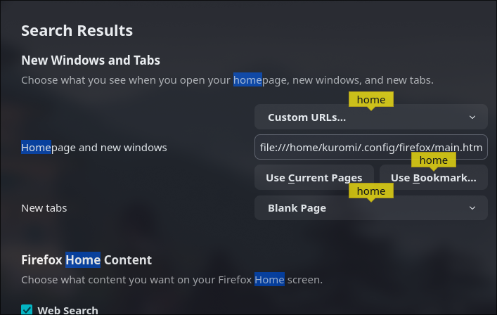
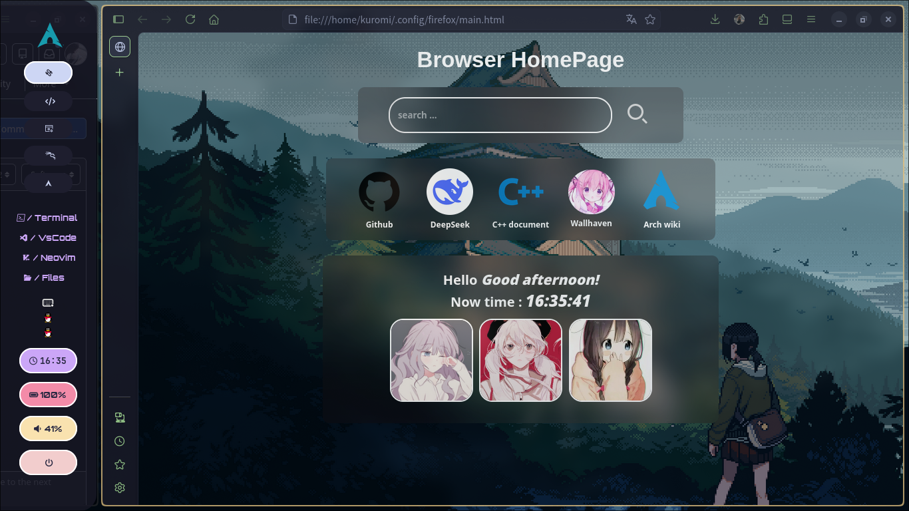
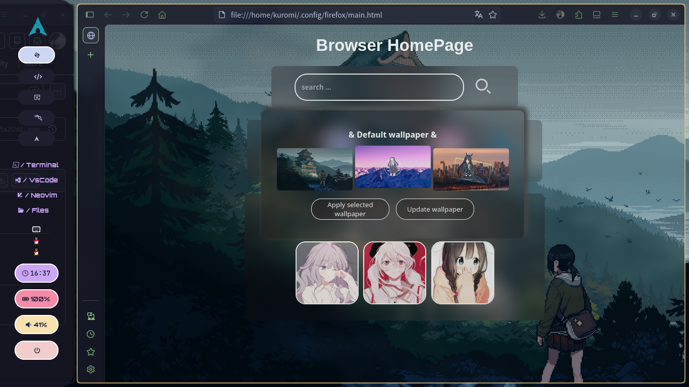
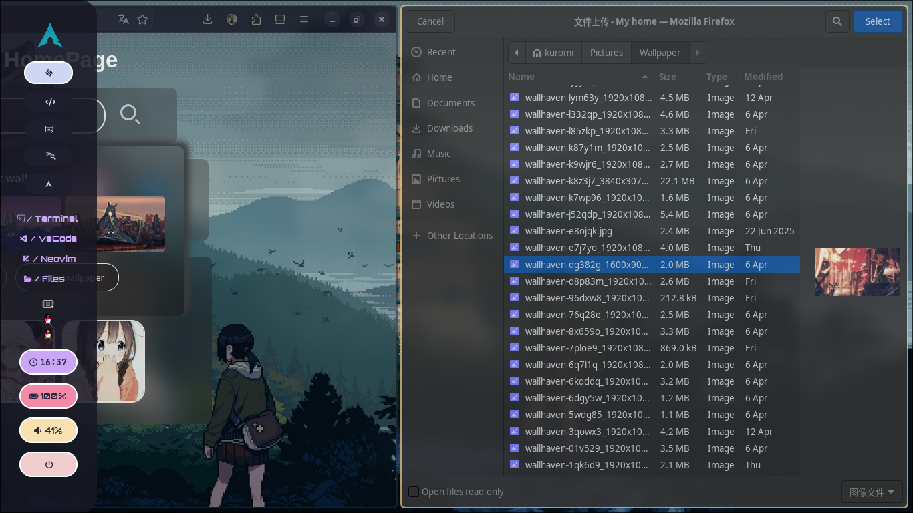
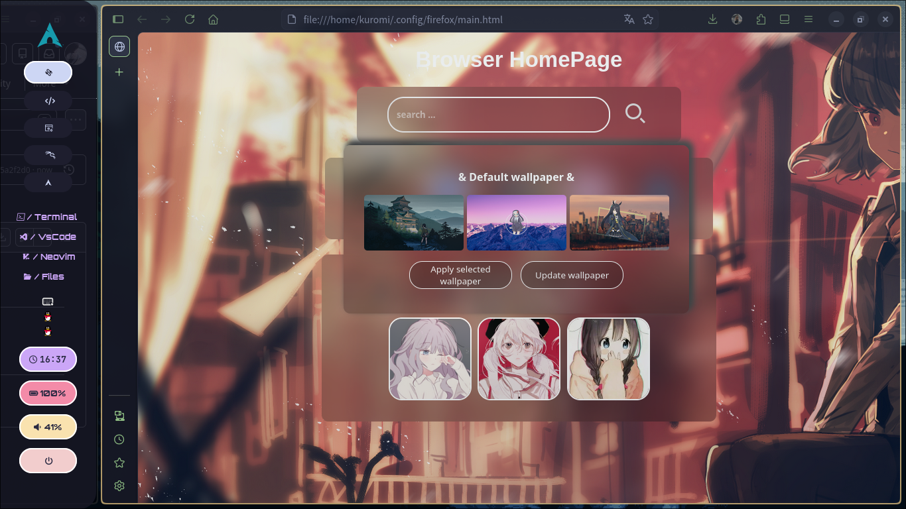
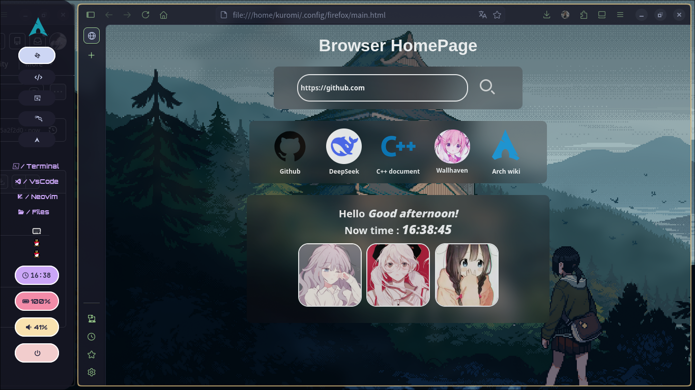
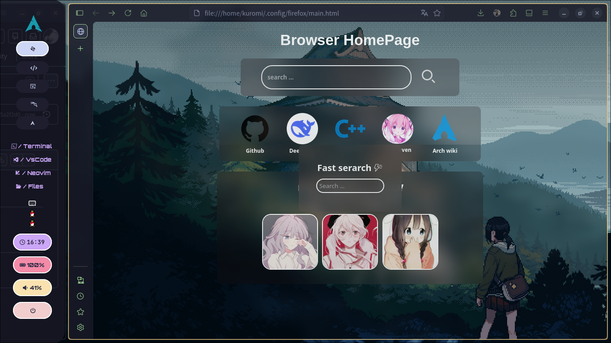

# My-browser-home-page
A simple browser start page for your own configuration sharing

## Example install

```bash

#Clone project
git clone https://github.com/kloveme/My-browser-home-page

cd My-browser-home-page

ls

cd ..

#Create config folder
mkdir -p ~/.config/firefox/

#Copy config
cp -r My-browser-home-page/* ~/.config/firefox/

```

### 1. Go to the Firefox browser and search for 'Home' Find the location shown in the picture and change the URL option to 'file:///home/your_name/.config/firefox/main.html' 
### 2. Close the browser and reopen it to see the configured homepage




# Images

### Search Method: 1. Search in the search box, you can select Enter to start the search


### Wallpaper change shortcut: Alt + w [lowercase 'w'] will pop up a pop-up window with three default wallpapers to choose from, click 'Apply selected wallpaper' to replace it


### The method to choose a wallpaper you like is as follows: click the 'Update Wallpaper' button, and your folder window will pop up. Select a wallpaper you like, and then click 'Apply selected wallpaper' to make the change



### If you write a URL in the search bar, you can go directly; on the contrary, if you write text, it will call Bing search


### In addition to searching through the search bar, I also made a shortcut: 'Alt + r [lowercase]' will bring up a quick search window, and 'Esc' cancels it. Supports searching for URLs and text

